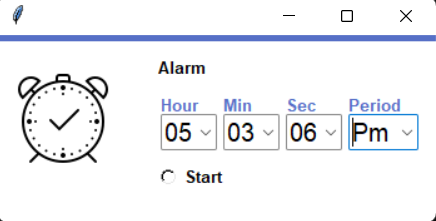
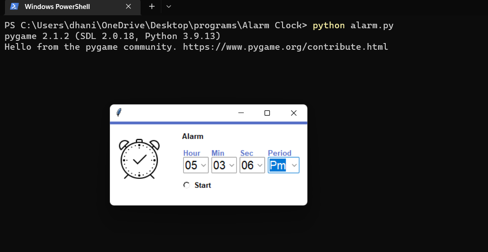

# Alarm-Clock
To use, first download all the files and place them in one folder. Then make sure all the module libraries are present,if not use 'pip install' command.Then run the code and se the alarm clock.

The alarm clock looks like the following : 

This is how the command-line interface should look after running code : 

